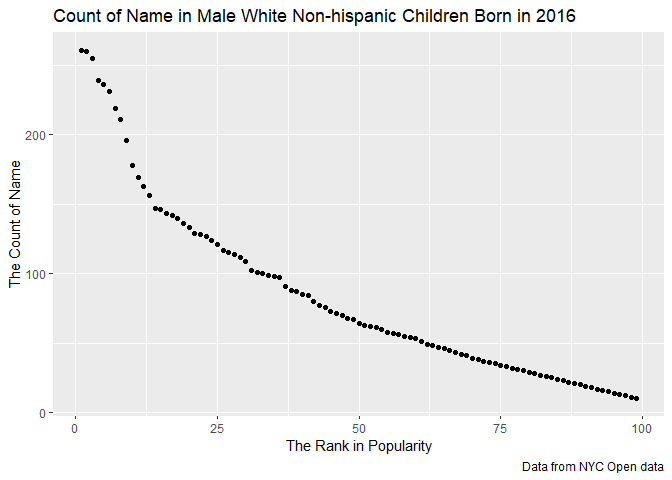

p8105\_hw2\_yj2581
================
YucongJiang
2019-10-2

Problem 1
---------

``` r
mr_trash_wheel <- read_excel("data/Trash-Wheel-Collection-Totals-8-6-19.xlsx", 
                             sheet = "Mr. Trash Wheel", 
                             range = "A2:N408") %>%
  janitor::clean_names() %>%
  drop_na(dumpster) %>%
  mutate(sports_balls = as.integer(round(sports_balls)))
```

    ## Warning in FUN(X[[i]], ...): strings not representable in native encoding
    ## will be translated to UTF-8

``` r
precipitation_2017 <- read_excel("data/Trash-Wheel-Collection-Totals-8-6-19.xlsx",
                                 sheet = "2017 Precipitation",
                                 skip = 1) %>%
  janitor::clean_names() %>%
  drop_na(month) %>%
  mutate(year = 2017)

precipitation_2018 <- read_excel("data/Trash-Wheel-Collection-Totals-8-6-19.xlsx",
                                 sheet = "2018 Precipitation",
                                 skip = 1) %>%
  janitor::clean_names() %>%
  drop_na(month) %>%
  mutate(year = 2018)

precipitation_combine <- full_join(precipitation_2017, precipitation_2018) %>%
  mutate(month = as.character(month.name[month]))
```

    ## Joining, by = c("month", "total", "year")

#### Describe the data

``` r
pols_month <- read_csv("data/pols-month.csv") %>%
  separate(mon, c("year", "month", "day"), "-", convert = TRUE) %>%
  mutate(month = as.character(month.name[month])) %>%
  mutate(president = if_else(prez_gop == 1, "gop", "dem")) %>%
  select(-day, -prez_gop, -prez_dem)
```

    ## Parsed with column specification:
    ## cols(
    ##   mon = col_date(format = ""),
    ##   prez_gop = col_double(),
    ##   gov_gop = col_double(),
    ##   sen_gop = col_double(),
    ##   rep_gop = col_double(),
    ##   prez_dem = col_double(),
    ##   gov_dem = col_double(),
    ##   sen_dem = col_double(),
    ##   rep_dem = col_double()
    ## )

``` r
snp <- read_csv("data/snp.csv") %>%
  separate(date, c("month", "day", "year"), "/", convert = TRUE) %>%
  arrange(year, month) %>%
  mutate(month = as.character(month.name[month])) %>%
  select(year, month, close)
```

    ## Parsed with column specification:
    ## cols(
    ##   date = col_character(),
    ##   close = col_double()
    ## )

``` r
unemployment <- read_csv("data/unemployment.csv") %>%
  rename(
    year = Year,
    January = Jan,
    February = Feb,
    March = Mar,
    April = Apr,
    June = Jun,
    July = Jul,
    August = Aug,
    September = Sep,
    October = Oct,
    November = Nov,
    December = Dec) %>%
  pivot_longer(
    January:December,
    names_to = "month",
    values_to = "unemployment_proportion") %>%
  drop_na(unemployment_proportion)
```

    ## Parsed with column specification:
    ## cols(
    ##   Year = col_double(),
    ##   Jan = col_double(),
    ##   Feb = col_double(),
    ##   Mar = col_double(),
    ##   Apr = col_double(),
    ##   May = col_double(),
    ##   Jun = col_double(),
    ##   Jul = col_double(),
    ##   Aug = col_double(),
    ##   Sep = col_double(),
    ##   Oct = col_double(),
    ##   Nov = col_double(),
    ##   Dec = col_double()
    ## )

``` r
merge_table <- full_join(pols_month, snp, by = c("year", "month")) %>%
  full_join(unemployment, by = c("year", "month"))
```

#### Describe the data

``` r
popular_baby_names <- read.csv("data/Popular_Baby_Names.csv") %>%
  janitor::clean_names() %>%
  mutate(
    ethnicity = replace(ethnicity, ethnicity == "ASIAN AND PACI", "ASIAN AND PACIFIC ISLANDER"),
    ethnicity = replace(ethnicity, ethnicity == "BLACK NON HISP", "BLACK NON HISPANIC"),
    ethnicity = replace(ethnicity, ethnicity == "WHITE NON HISP", "WHITE NON HISPANIC"),
    ethnicity = as.factor(as.character(ethnicity)),
    child_s_first_name = str_to_title(child_s_first_name)
  ) %>%
  distinct()
```

``` r
olivia_popularity <- filter(popular_baby_names, child_s_first_name == "Olivia" & gender == "FEMALE") %>%
  select(ethnicity, year_of_birth, rank) %>%
  rename(Ethnicity = ethnicity) %>%
  arrange(year_of_birth) %>%
  pivot_wider(
    names_from = "year_of_birth",
    values_from = "rank"
  )

most_popular_boyname <- filter(popular_baby_names, rank == 1 & gender == "MALE") %>%
  select(ethnicity, year_of_birth, child_s_first_name) %>%
  rename(Ethnicity = ethnicity) %>%
  arrange(year_of_birth) %>%
  pivot_wider(
    names_from = "year_of_birth",
    values_from = "child_s_first_name"
  )

knitr::kable(olivia_popularity)
```

| Ethnicity                  |  2011|  2012|  2013|  2014|  2015|  2016|
|:---------------------------|-----:|-----:|-----:|-----:|-----:|-----:|
| ASIAN AND PACIFIC ISLANDER |     4|     3|     3|     1|     1|     1|
| BLACK NON HISPANIC         |    10|     8|     6|     8|     4|     8|
| HISPANIC                   |    18|    22|    22|    16|    16|    13|
| WHITE NON HISPANIC         |     2|     4|     1|     1|     1|     1|

``` r
knitr::kable(most_popular_boyname)
```

| Ethnicity                  | 2011    | 2012   | 2013   | 2014   | 2015   | 2016   |
|:---------------------------|:--------|:-------|:-------|:-------|:-------|:-------|
| ASIAN AND PACIFIC ISLANDER | Ethan   | Ryan   | Jayden | Jayden | Jayden | Ethan  |
| BLACK NON HISPANIC         | Jayden  | Jayden | Ethan  | Ethan  | Noah   | Noah   |
| HISPANIC                   | Jayden  | Jayden | Jayden | Liam   | Liam   | Liam   |
| WHITE NON HISPANIC         | Michael | Joseph | David  | Joseph | David  | Joseph |

``` r
count_vs_rank <- filter(popular_baby_names, gender == "MALE" & ethnicity == "WHITE NON HISPANIC" & year_of_birth == 2016) %>%
  select(count, rank)

ggplot(count_vs_rank, aes(x = rank, y = count)) + 
  geom_point() +
  labs(
    title = "Count of Name in Male White Non-hispanic Children Born in 2016",
    x = "The Rank in Popularity",
    y = "The Count of Name",
    caption = "Data from NYC Open data"
  )
```


